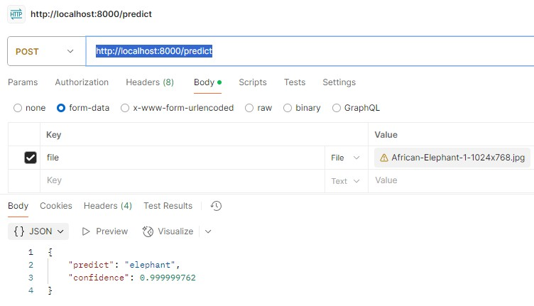

# Proyek Klasifikasi Gambar

> Python 3.11.11

### Informasi Dataset

Dataset diambil dari Kaggle [https://www.kaggle.com/datasets/alessiocorrado99/animals10](https://www.kaggle.com/datasets/alessiocorrado99/animals10).

Berisi sekitar 28 ribu gambar hewan berkualitas sedang yang termasuk dalam 10 kategori: anjing, kucing, kuda, laba-laba, kupu-kupu, ayam, domba, sapi, tupai, gajah.

### Dimana saya melatih model saya?

Saya melatih model saya menggunakan Google Colab dengan GPU T4 dan `requirements.txt` yang saya dapatkan merupakan hasil command `!pip freeze > requirements.txt` dari Google Colab.

### Model apa yang saya gunakan?

Saya menggunakan pre-trained model [MobileNetV2](https://keras.io/api/applications/mobilenet/) karena merupakan salah satu model yang ringan dan efisien. Setelah itu, semua layer [MobileNetV2](https://keras.io/api/applications/mobilenet/) di *freeze*. Menambahkan **Conv2D**, **MaxPooling2D**, **Dropout**, **Flatten**, dan **Dense Layers**, model yang saya rancang siap dilatih dan digunakan.

### Bagaimana cara menjalankan TF Serving?

Pastikan [Docker](https://www.docker.com/) sudah terinstall pada perangkat Anda. Dengan menjalankan perintah `docker-compose up --build`. Model siap di test menggunakan [Postman](https://www.postman.com/) atau aplikasi lain yang serupa.

1. Buka [Postman](https://www.postman.com/)
2. Salin URL `http://localhost:8000/predict` pada [Postman](https://www.postman.com/)
3. Pada `Body` -> `form-data`, masukkan `Key` dengan nama `file` dan masukkan salah satu gambar yang terdapat pada `Test Data`.

